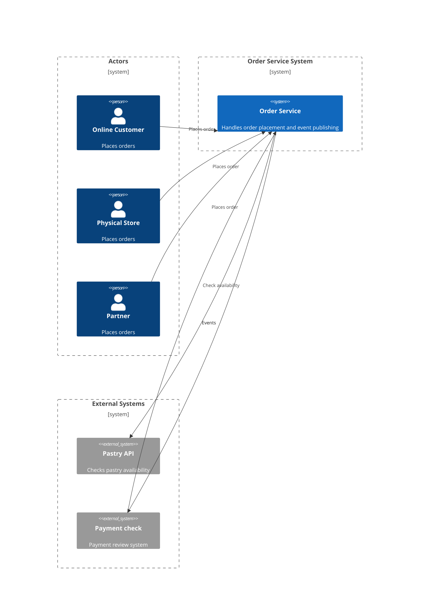

# Project Overview

## Context
Order Service for online, physical stores, and partners to place orders for fresh-baked pastries. The service exposes a REST API to its consumers and integrates with external systems via Kafka events.

## Architecture
- Clean Architecture
- DDD principles
- Deployment: Microservices
- Event-driven, REST API, Kafka integration
- Microcks integration for API and event simulation

## Main Flows
- Order creation with product availability check
- Order is persisted only if products are available; otherwise, the order is rejected
- Event publishing to Kafka after order creation (OrderEvent)
- Order status update via event listener when a review event is received from another Kafka topic
- API and event simulation using Microcks
- Contract testing for REST and event-driven flows

## C4 Context Diagram (optional, Mermaid)

